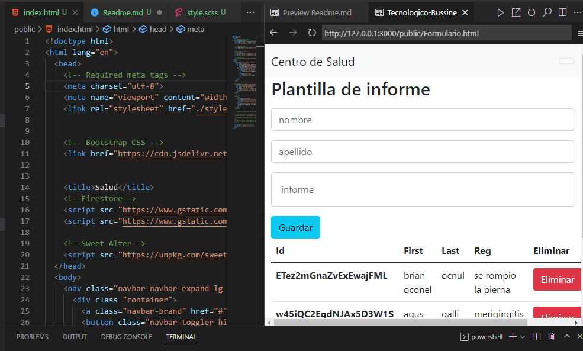

# Consultorio Medico
### Pagina creada por Brian Galli
---
>Plantilla de Informes
>>Plantilla para pacientes -Guatrdar & Acualizar

*Visual Studio Code IDE*  
  
    Programming:
        1. HTML
        2. CSS
        3. Bootstrap
        4. Sass
        5. Firebase
        6. Node.js

**Dante Creed GitHub Profile**
[Pulsa aqui!](https://github.com/dantecreedar) :sunglasses:
